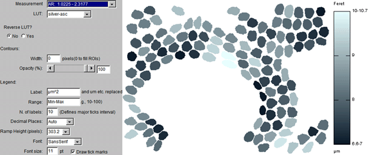
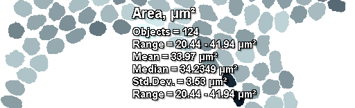
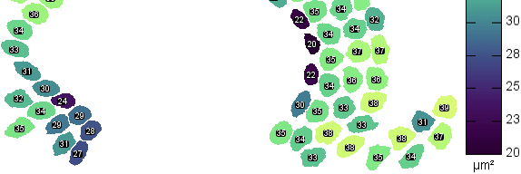
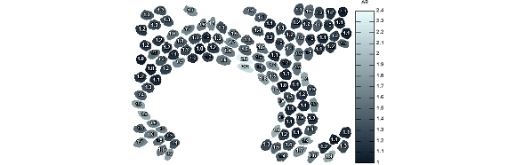

# Annotation

[BARs][Home] related to annotation of images.

###[Combine Orthogonal Views](./Combine_Orthogonal_Views.ijm)
   Appends top, bottom and side views to a stack in a similar way to _Image>Stacks>Ortogonal Views_
   but extending projected views to the entire volume rather than displaying single slices. Empty
   spaces in the image canvas will be painted with background color (frame around the Color Picker
   Tool in the ImageJ toolbar).

###[Cumulative Z-Project](./Cumulative_Z-Project.bsh)
   Produces cumulative projections using ImageJ's built-in projector (_Image>Stacks>Z Project..._).
   An immediate application of these progressive projections is the display of trailing paths of
   moving particles in timelapse experiments.

###[ROI Color Coder](./ROI_Color_Coder.ijm)
   Colorizes ROI Manager selections by matching measurements to a lookup table (LUT),
   generating particle-size heat maps. More information can be found on its initial
   [documentation page][RCC page], that has yet to be transferred to [imagej.net](http://imagej.net/).

   
   

   See Also [Calibration Menu](../Tools/README.md#calibration-menu)

[RCC page]: http://imagejdocu.tudor.lu/doku.php?id=macro:roi_color_coder

______________This entire fork merely adds 5 extended versions of the color coding script!
###[BAR_ROI_Color_Coder53+autoprefs](./BAR_ROI_Color_Coder53+autoprefs_ASC.ijm)
  Additional features include:
       1. The measured range of values is shown for all measurements in the Measurement selector (this makes it easier to manually select a range for the color ramp).
       
       2. The selected LUT (color lookup table) can be reversed.
       
       3. An automatic suggested value for the decimal places can be selected (based on the magnitude and range of the values).
       
       4. A ramp height is suggested base on the image height.
       
      5. Parameter and unit labels added to the top an bottom of ramp respectively.
      
      6. Overrun labels are added to the ramp if the true range exceeds the range chosen for the ramp (see example below). This is useful when there are just a few outliers that would otherwise reduce the contrast variation for the majority of the features.
      
      7. Any previous ramp is closed before creation of a new ramp.      
      
      8. Provides an option at the end to create a new merged image combining labeled image and legend (the legend/ramp height is scaled to match the height of the image).
      

###[BAR_ROI_Color_Coder53+autoprefs+summary](./BAR_ROI_Color_Coder53+autoprefs+Summary_ASC.ijm)

      Additional feature over those listed above:
      
      A label can be added in the corners, center or a selected location listing up to 6 lines of statistics.
   
      
###[BAR_ROI_Color_Coder_with_ROIManagerLabels](./BAR_ROI_Color_Coder_with_ROIManagerLabels_ASC.ijm)
        Additional features over the autoprefs macro listed above:
        Each ROI is renamed with the chosen feature value and these are used as labels.
   
        
###[BAR_ROI_Color_Coder_with_ScaledLabels](./BAR_ROI_Color_Coder_with_ScaledLabels_ASC.ijm)
      Additional features over the autoprefs macro listed above:
      Each ROI is labeled with the chosen feature value using extensive formatting options. If <a href="http://www.mecourse.com/landinig/software/software.html">Gabriel Landini's &quot;Morphology&quot; plugin</a> is installed it will allow you to center the labels at the morphological centers of the objects (better than centroids for complex shapes because these points are always inside the original objects).
   !

###[BAR_ROI_Color_Coder+ScaledLabels+Summary](./BAR_ROI_Color_Coder+ScaledLabels+Summary_ASC.ijm)
      As above but now also has the Summary table option.
[Color Coder example for scaled labels and summary version using asc-silver LUT](../../../../../../../images/BAR_ROI_Coder_withScaledLabels_exampleandSummary_anim575x186.gif)

| [Home] | [Analysis] | [Data Analysis] | [Annotation] | [Segmentation] | [Tools] | [Plugins][Java Classes] | [lib] | [Snippets] | [IJ] |
|:------:|:----------:|:---------------:|:------------:|:--------------:|:-------:|:-----------------------:|:-----:|:----------:|:----:|

[Home]: https://github.com/tferr/Scripts#ij-bar
[Analysis]: https://github.com/tferr/Scripts/tree/master/BAR/src/main/resources/scripts/BAR/Analysis#analysis
[Annotation]: https://github.com/tferr/Scripts/tree/master/BAR/src/main/resources/scripts/BAR/Annotation#annotation
[Data Analysis]: https://github.com/tferr/Scripts/tree/master/BAR/src/main/resources/scripts/BAR/Data_Analysis#data-analysis
[Segmentation]: https://github.com/tferr/Scripts/tree/master/BAR/src/main/resources/scripts/BAR/Segmentation#segmentation
[Tools]: https://github.com/tferr/Scripts/tree/master/Tools#tools-and-toolsets
[Java Classes]: https://github.com/tferr/Scripts/tree/master/BAR#java-classes
[lib]: https://github.com/tferr/Scripts/tree/master/lib#lib
[Snippets]: https://github.com/tferr/Scripts/tree/master/Snippets#snippets
[IJ]: http://imagej.net/BAR
