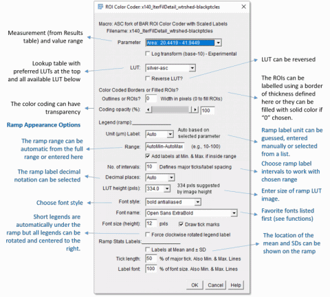
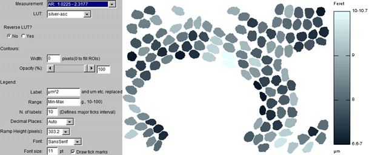
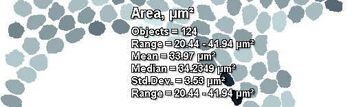
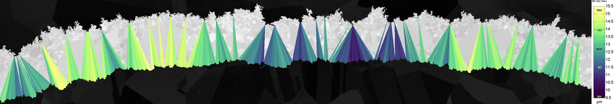

_____________This entire fork merely adds <a href="https://github.com/peterjlee/Scripts/BAR/src/main/resources/scripts/BAR/Annotation/" Title = "Applied Superconductivity Center Object Color Coding Macro Directory" >4 extended versions</a> of the BAR color coding script and one for color coding lines.

###[BAR_ROI_Color_Coder+autoprefs_ASC](https://github.com/peterjlee/Scripts/BAR/src/main/resources/scripts/BAR/Annotation/BAR_ROI_Color_Coder%2Bautoprefs_ASC.ijm)

 Additional features include:

1. The measured range of values is shown for all measurements in the Measurement selector (this makes it easier to manually select a range for the color ramp).

2. The selected LUT (color lookup table) can be reversed.

3. An automatic suggested value for the decimal places can be selected (based on the magnitude and range of the values).

4. A ramp height is suggested base on the image height.

5. Parameter and unit labels added to the top an bottom of ramp respectively.

6. Overrun labels are added to the ramp if the true range exceeds the range chosen for the ramp (see example below). This is useful when there are just a few outliers that would otherwise reduce the contrast variation for the majority of the features.

7. Any previous ramp is closed before creation of a new ramp.

8. Provides an option at the end to create a new merged image combining labeled image and legend (the legend/ramp height is scaled to match the height of the image).

9. Select any system font (and have favorites list).

10. LUTs list has preferred LUTs at top (edit getLutsList function).

###[BAR_ROI_Color_Coder53+autoprefs+summary](./BAR/src/main/resources/scripts/BAR/Annotation/BAR_ROI_Color_Coder53+autoprefs+Summary_ASC.ijm)

Additional feature over those listed above:
      
A summary list can be added in the corners, center or a selected location listing up to 6 lines of statistics.

     
###[BAR_ROI_Color_Coder_with_ROIManagerLabels](https://github.com/peterjlee/Scripts/BAR/src/main/resources/scripts/BAR/Annotation/BAR_ROI_Color_Coder_with_ROIManagerLabels_ASC.ijm)

        Additional features over the autoprefs macro listed above:

        Each ROI is renamed with the chosen feature value and these are used as labels.

   
        
###[BAR_ROI_Color_Coder_with_ScaledLabels](https://github.com/peterjlee/Scripts/BAR/src/main/resources/scripts/BAR/Annotation/BAR_ROI_Color_Coder_with_ScaledLabels_ASC.ijm)

      Additional features over the autoprefs macro listed above:

      Each ROI is labeled with the chosen feature value using extensive formatting options. If <a href="http://www.mecourse.com/landinig/software/software.html">Gabriel Landini's &quot;Morphology&quot; plugin</a> is installed it will allow you to center the labels at the morphological centers of the objects (better than centroids for complex shapes because these points are always inside the original objects).

###[BAR_ROI_Color_Coder+ScaledLabels+Summary](https://github.com/peterjlee/Scripts/BAR/src/main/resources/scripts/BAR/Annotation/BAR_ROI_Color_Coder+ScaledLabels+Summary_ASC.ijm)

      As above but now also has the Summary table option.

[Color Coder example for scaled labels and summary version using asc-silver LUT with ramp frequency plot and ln stats](./images/BAR_ROI_Coder_withScaledLabels_example_LnHistSummary_crop575x186.gif)

###[LineColorCoder](https://github.com/peterjlee/Scripts/BAR/src/main/resources/scripts/BAR/Annotation/Line_Color_Coder.ijm)

      Inspired by the BAR ROI Color Coder this macro color codes lines according to any Results table parameter.

_________________________________________________________________

_________________________________________________________________

The original BAR README.................</>

# IJ BAR

Welcome to the **IJ BAR**: A collection of <b>B</b>roadly <b>A</b>pplicable <b>R</b>outines for
[ImageJ](http://imagej.net/), the de facto standard in scientific image processing in the life
sciences.

To install BAR, download the latest version of [Fiji](http://imagej.net/Fiji) and subscribe to the
[BAR update site](http://imagej.net/List_of_update_sites).
For more details refer to the [BAR documentation page](http://imagej.net/BAR#Installation).

## [Analysis]
  Routines that complement built-in commands in the ImageJ `Analyze>` menu.

  1. (py) [LoG-DoG Spot Counter](./BAR/src/main/resources/scripts/BAR/Analysis/README.md#log-dog-spot-counter)
  2. (bsh) [Multichannel Plot Profile](./BAR/src/main/resources/scripts/BAR/Analysis/README.md#multichannel-plot-profile)
  3. (bsh) [Multichannel ZT-axis Profile](./BAR/src/main/resources/scripts/BAR/Analysis/README.md#multichannel-zt-axis-profile)
  4. (bsh) [Smoothed Plot Profile](./BAR/src/main/resources/scripts/BAR/Analysis/README.md#smoothed-plot-profile)

## [Data Analysis]
  Operations related to statistics, profiles, histograms and curve fitting.

  1. (bsh) [Create Boxplot](./BAR/src/main/resources/scripts/BAR/Data_Analysis/README.md#create-boxplot)
  2. (bsh) [Create Polar Plot](./BAR/src/main/resources/scripts/BAR/Data_Analysis/README.md#create-polar-plot)
  3. (ijm) [Distribution Plotter](./BAR/src/main/resources/scripts/BAR/Data_Analysis/README.md#distribution-plotter)
  4. (bsh) [Find Peaks](./BAR/src/main/resources/scripts/BAR/Data_Analysis/README.md#find-peaks)
  5. (bsh) [Fit Polynomial](./BAR/src/main/resources/scripts/BAR/Data_Analysis/README.md#fit-polynomial)
  6. (java) [Interactive Plotting](./BAR/src/main/resources/scripts/BAR/Data_Analysis/README.md#interactive-plotting)

## [Image Annotation][Annotation]
  Aiders for the annotation of scientific images.

  1. (ijm) [Combine Orthogonal Views](./BAR/src/main/resources/scripts/BAR/Annotation/README.md#combine-orthogonal-views)
  2. (bsh) [Cumulative Z-Project](./BAR/src/main/resources/scripts/BAR/Annotation/README.md#cumulative-z-project)
  3. (ijm) [ROI Color Coder](./BAR/src/main/resources/scripts/BAR/Annotation/README.md#roi-color-coder)

## [Image Segmentation][Segmentation]
  Routines for partitioning images into analyzable parts.

  1. (java) [Shen-Castan Edge Detector](./BAR/src/main/resources/scripts/BAR/Segmentation/README.md#shen-castan-edge-detector)
  2. (ijm) [Apply Threshold To ROI](./BAR/src/main/resources/scripts/BAR/Segmentation/README.md#apply-threshold-to-roi)
  3. (ijm) [Clear Thresholded Pixels](./BAR/src/main/resources/scripts/BAR/Segmentation/README.md#clear-thresholded-pixels)
  4. (bsh) [Remove Isolated Pixels](./BAR/src/main/resources/scripts/BAR/Segmentation/README.md#remove-isolated-pixels)
  5. (ijm) [Segment Profile Tool](./Tools/README.md#segment-profile-tool)
  6. (ijm) [Threshold From Background](./BAR/src/main/resources/scripts/BAR/Segmentation/README.md#threshold-from-background)
  7. (ijm) [Wipe Background](./BAR/src/main/resources/scripts/BAR/Segmentation/README.md#wipe-background)

## [Tools and Toolsets][Tools]
  Additions to the ImageJ toolbar.

  1. (ijm) [Calibration Menu](./Tools/README.md#calibration-menu)
  2. (ijm) [List Folder Menu](./Tools/README.md#list-folder-menu)
  3. (ijm) [Segment Profile Tool](./Tools/README.md#segment-profile-tool)
  4. (ijm) [Shortcuts Menu](./Tools/README.md#shortcuts-menu)
  5. (ijm) [ROI Manager Tools](./Tools/README.md#roi-manager-tools)
  6. (ijm) [Toolset Creator](./Tools/README.md#toolset-creator)

## [Snippets]
  Example scripts (in several languages) to be used as scripting templates, including:

  1. (py) [Extract Bouts From Tracks](./Snippets/README.md#extract-bouts-from-tracks)
  2. (groovy) [List BARs](./Snippets/README.md#list-bars)
  3. (py) [Median Filter](./Snippets/README.md#median-filter)
  4. (py) [NN Distances](./Snippets/README.md#nn-distances)
  5. [Batch Processors](./Snippets/README.md#batch-processors)
    1. (ijm) [Process Folder IJM](./Snippets/README.md#process-folder-ijm)
    2. (py) [Process Folder PY](./Snippets/README.md#process-folder-py)
  6. (bsh) [Search BAR](./Snippets/README.md#search-bar)

## [lib]
  User-defined libraries (scripting additions) in a centralized repository. These are methods and
  functions that can be conveniently shared across files.

  1. [BeanShell library](./lib/README.md#bsh-lib)
  2. [Clojure library](./lib/README.md#clj-lib)
  3. [Groovy library](./lib/README.md#gvy-lib)
  4. [IJ Macro library](./lib/README.md#ijm-lib)
  5. [JavaScript library](./lib/README.md#js-lib)
  6. [Python library](./lib/README.md#py-lib)
  7. [Ruby library](./lib/README.md#rb-lib)

## Utilities
  Productivity software.

  1. [BAR Commander](./BAR/src/main/java/bar/plugin/Commander.java), a keyboard-based file browser
  that produces filtered lists of directory contents. Features include: drag-and-drop support,
  interaction with native file manager, regex filtering, and built-in console for common operations.
  ([Documentation page](http://imagej.net/BAR#Commander))

## [Java Classes]
  Maven project implementing the backbone of BAR, including several [plugins](./BAR/README.md#plugins),
  [utilities](./BAR/README.md#utilities), [External Ops](./BAR/README.md#external-ops),the structure
  of the BAR menu and the [BAR API](http://tferr.github.io/Scripts/apidocs/). While BAR is mainly a
  suite of ImageJ1 add-ons, some [BAR plugins](./BAR/README.md#plugins) explore the scripting
  capabilities of [ImageJ2](http://imagej.net/ImageJ2).

## Tutorials
  1. [Introduction to Scripting](./Snippets/Tutorials/README.md#tutorials) Tutorials used
     in the workshop [Scripting with BAR](http://imagej.net/Conference_2015_Program#Tiago_Ferreira_-_Scripting_with_BAR),
     at the [2015 ImageJ User & Developer Conference](http://imagej.net/Conference_2015).
  1. [External Ops](./BAR/README.md#external-ops): Tutorial exemplifying how to provide
     [ops](http://imagej.net/ImageJ_Ops).

## [Misc]
  Scripts that are not distributed through the BAR update site:

  1. [Capture Window](./misc/README.md#capture-window)
  2. [Clipboard to Results](./misc/README.md#clipboard-to-results)

## Help?
 * Want to Contribute to BAR?
    * Thanks! Please, please do! See [here](https://guides.github.com/activities/contributing-to-open-source/)
    and [here](https://help.github.com/articles/fork-a-repo) for details on how to
    [fork](https://github.com/tferr/Scripts/fork) BAR or
    [here](https://help.github.com/articles/using-pull-requests) on how to initiate a
    [pull request](https://github.com/tferr/Scripts/pulls)
    * Documentation updates are also welcome, so go ahead and improve the [BAR documentation page][IJ]
 * Having problems? Found a bug? Need to ask a question?
    * See the BAR [FAQs](http://imagej.net/BAR#FAQ), Fiji [FAQs](http://imagej.net/Frequently_Asked_Questions)
    and [Bug reporting best practices](http://imagej.net/Bug_reporting_best_practices). Then, you can either:
      * [Open an issue](https://github.com/tferr/Scripts/issues) on this repository
      * Report it on the [ImageJ mailing list](http://imagej.nih.gov/ij/list.html)

## Citations

* To cite BAR:

  

* BAR scripts have contributed to the following publications:

  1. Ferreira et al. Neuronal morphometry directly from bitmap images. Nature Methods (2014), 11(10):982–984. [PMID 25264773](http://www.ncbi.nlm.nih.gov/pubmed/25264773)
  1. Pope and Voigt. Peripheral glia have a pivotal role in the initial response to axon degeneration of peripheral sensory neurons in zebrafish. PLoS ONE (2014), 9(7):e103283. [PMID 25058656](http://www.ncbi.nlm.nih.gov/pubmed/25058656)
  1. Medda et al. Investigation of early cell-surface interactions of human mesenchymal stem cells on nanopatterned β-type titanium-niobium alloy surfaces. Interface Focus (2014), 4(1):20130046. [PMID 24501674](http://www.ncbi.nlm.nih.gov/pubmed/24501674)
  1. Ferreira et al. Dendrite architecture is organized by transcriptional control of F-actin nucleation. Development (2014), 141(3):650–60. [PMID 24449841](http://www.ncbi.nlm.nih.gov/pubmed/24449841)
  1. Dobens and Dobens. FijiWings: an open source toolkit for semiautomated morphometric analysis of insect wings. G3 (Bethesda) (2013), 3(8):1443-9. [PMID 23797110](http://www.ncbi.nlm.nih.gov/pubmed/23797110)
  1. van der Meer et al. Three-dimensional co-cultures of human endothelial cells and embryonic stem cell-derived pericytes inside a microfluidic device. Lab Chip (2013), 13(18):3562-8. [PMID 23702711](http://www.ncbi.nlm.nih.gov/pubmed/23702711)
  1. Soulet et al. Automated filtering of intrinsic movement artifacts during two-photon intravital microscopy. PLoS ONE (2013), 8(1):e53942. [PMID 23326545](http://www.ncbi.nlm.nih.gov/pubmed/23326545)
  1. Paolicelli et al. Synaptic pruning by microglia is necessary for normal brain development. Science (2011), 9;333(6048):1456-8. [PMID 21778362](http://www.ncbi.nlm.nih.gov/pubmed/21778362)
  1. Carnevalli et al. S6K1 plays a critical role in early adipocyte differentiation. Developmental Cell (2010), 18(5):763-74. [PMID 20493810](http://www.ncbi.nlm.nih.gov/pubmed/20493810)

License
-------
This program is free software: you can redistribute them and/or modify them under the terms of the
[GNU General Public License](http://www.gnu.org/licenses/gpl.txt) as published by the Free Software
Foundation, either version 3 of the License, or (at your option) any later version.

Contributors
------------
BAR was created and is maintained by [Tiago Ferreira](http://imagej.net/User:Tiago)
with contributions from
Maxime Pinchon,
[Johannes Schindelin](https://github.com/dscho),
[Wayne Rasband](http://imagej.nih.gov/ij/),
[Mark Hiner](https://github.com/hinerm),
[Jerome Mutterer](https://github.com/mutterer),
[Kota Miura](https://github.com/cmci),
Nicolas Vanderesse, Peter J. Lee
and [Jan Eglinger](https://github.com/imagejan).
BAR uses public domain [code](./BAR/src/main/java/bar/FileDrop.java) from Robert Harder and Nathan
Blomquist. This project would not have been possible without the support of the outstanding
[ImageJ community](http://imagej.net/Mailing_Lists).

| [Analysis] | [Data Analysis] | [Annotation] | [Segmentation] | [Tools] | [Plugins][Java Classes] | [lib] | [Snippets] | [IJ] |
|:----------:|:---------------:|:------------:|:--------------:|:-------:|:-----------------------:|:-----:|:----------:|:----:|

[Analysis]: https://github.com/tferr/Scripts/tree/master/BAR/src/main/resources/scripts/BAR/Analysis#analysis
[Data Analysis]: https://github.com/tferr/Scripts/tree/master/BAR/src/main/resources/scripts/BAR/Data_Analysis#data-analysis
[Annotation]: https://github.com/tferr/Scripts/tree/master/BAR/src/main/resources/scripts/BAR/Annotation#annotation
[Segmentation]: https://github.com/tferr/Scripts/tree/master/BAR/src/main/resources/scripts/BAR/Segmentation#segmentation
[Tools]: https://github.com/tferr/Scripts/tree/master/Tools#tools-and-toolsets
[Java Classes]: https://github.com/tferr/Scripts/tree/master/BAR#java-classes
[lib]: https://github.com/tferr/Scripts/tree/master/lib#lib
[Snippets]: https://github.com/tferr/Scripts/tree/master/Snippets#snippets
[IJ]: http://imagej.net/BAR
[Misc]:https://github.com/tferr/Scripts/tree/master/misc#misc
